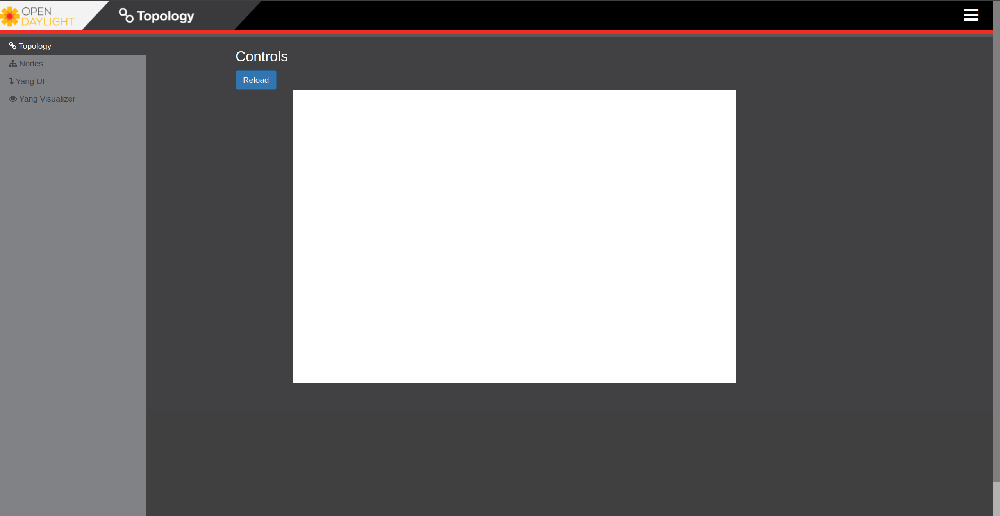

# Overview

-----------------------------------

This project entails the development of an intent-based network simulator and emulator. In essence, users will articulate their intentions, and the system will subsequently generate and simulate diverse network scenarios. While initially focused on Software-Defined Networking (SDN), the system will evolve to accommodate Non-SDN environments in the near future. Furthermore, it will boast scalable capabilities, allowing users to create networks on a varying scale. Additionally, the system will incorporate network performance analysis, enabling users to evaluate the performance of simulated networks. Moreover, while emulation was paramount initially, simulation capabilities will soon be available. Depending on the specifications and different networks, the system will be used to emulate or simulate, having the tactical networks for this stage as a central point.

<table style="margin: 0 auto;">
  <tr>
    <th> Network Controller</th>
    <th> Network Simulator/Emulator</th>
  </tr>
  <!---->
  <!---->
  <tr>
    <td style="vertical-align: top;">
     
<strong><em><u>Current Form:</u><em></strong>

    The Controller is not the SDN in this stage, but for that regard is using the ODL while   
        is still in development.</td>
    <td style="vertical-align: top;">
    
<strong><em><u>Current Form:</u><em></strong>

    The emulation is done using Mininet and the simulation is using GNS3</td>
  </tr>
  <!---->
  <!---->
  <tr>
    <td style="vertical-align: top;">
    
<strong><em><u>Technologies uesd:</u><em></strong>

        * Java 21  
        * Kafka  
        * Kubernetes  
        * and many others
    </td>
    <!---->
    <td style="vertical-align: top;">
     
<strong><em><u>Technologies uesd:</u><em></strong>

      * Java 17  
      * Ubuntu 14.04 (For mininet) / any other Linux distribution that supports GNS3
    </td>
  </tr>
  <!---->
  <!---->
  <tr>
    <td style="vertical-align: top;">
    
<strong><em><u>Responsability:</u><em></strong>

      The Controller will act as a pivotal interface for user interaction with the system.   
      Additionally, it will conduct network analysis based on the selected environments and   
      intended network topology, providing comprehensive insights.
    </td>
    <!---->
    <td style="vertical-align: top;">
    
<strong><em><u>Responsability:</u><em></strong>

      The Network Simulator/Emulator will create and operate within the specified network   
      topology according to the chosen environment. Additionally, it offers multiple   
      functionalities, including self-cleaning and more.
    </td>
  </tr>
</table>

The current presentation provides a glimpse into the system's functionality; however, it's important to note that there are numerous additional features and capabilities that, due to privacy considerations, cannot be showcased at this time. Additionally, it's worth mentioning that this system is currently being utilized in various research papers.

-----------------------------------------

### System Specifications

<table style="margin: 0 auto;">

<tr>
    <th>Processor</th>
    <td>AMD Ryzen 7 4800H with Radeon Graphics 2.90 GHz</td>
</tr>
<tr>
    <th>GPU</th>
    <td>NVIDIA GeForce GTX 1650</td>
</tr>
<tr>
    <th>RAM</th>
    <td>16.0 GB DDR4</td>
</tr>
<tr>
    <th>SSD</th>
    <td>512GB PCIE G3</td>
</tr>

</table>

---------------------------------

## Mininet Simulator Tests

<figure><figcaption>VMware Hypervisor</figcaption></figure>

The figure above illustrates the VMware Hypervisor environment, depicting the essential setup of two virtual machines required for conducting tests. These include the ODL (OpenDaylight) and Mininet virtual machines, complemented by a Docker container hosting a database dedicated to this purpose.

-----------------------------------

<figure><figcaption>Start Emulator</figcaption></figure>

The figure above (Start Emulator) shows the command to initiate the Network Emulator.

------------------------

<figure><figcaption>ODL Web Empty</figcaption></figure>

The figure above (ODL Web Empty) depicts the ODL controller's initial state when no network has been initiated.

--------------------------------------------

<figure><figcaption>Create Topology Request</figcaption></figure>

The figure above (Create Topology Request) illustrates the HTTP request sent to the Network Emulator, specifying the intended network to be generated and created. Additionally, it showcases the system's processing time of 267 milliseconds and the response payload containing the actual topology, sized at 666 bytes.

---------------------------------------

<figure><figcaption>ODL Web Topology Created</figcaption></figure>

The figure above (ODL Web Topology Created) depicts the ODL controller's state following the creation of the topology, showcasing the desired switches as specified by the user and their randomly generated interconnections.

---------------------------------

<figure><figcaption>Commands Request</figcaption></figure>

The figure above (Command Request) illustrates the HTTP request sent to the Network Emulator, specifying a command for the emulator to execute. In this instance, the command involves pinging between all hosts to determine the loss percentage and to allow the controller to discover the complete topology, including the connected devices of the switches. Furthermore, it highlights the system's processing time of 21 milliseconds and the response payload containing the actual topology, sized at 294 bytes.

----------------------------------------

<figure><figcaption>ODL Web Commands</figcaption></figure>

The figure above (ODL Web Topology Commands) illustrates the ODL controller's state after executing the command, presenting the resulting changes in the topology as a reflection of the command's execution and providing a comprehensive view of the entire network topology.

-------------------------------------

<figure><figcaption>Stop Request</figcaption></figure>

The figure above (Stop Request) illustrates the HTTP request sent to the Network Emulator, specifying the termination of the emulation and cleaning of the virtual machine to be ready for the following topology. Furthermore, it highlights the system's processing time of 639 milliseconds (which will be reduced by half since there were many logs printed in this stage) and the response payload containing the actual topology, sized at 323 bytes.

--------------------------------------------------------------

<figure><figcaption>Database</figcaption></figure>

The figure above (Database) showcases the administrator page of the connected database, utilized for logging errors and various other purposes.

--------------------------------
